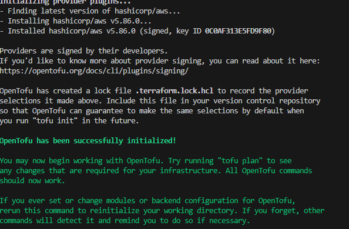
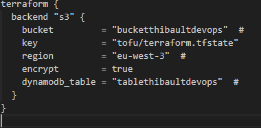
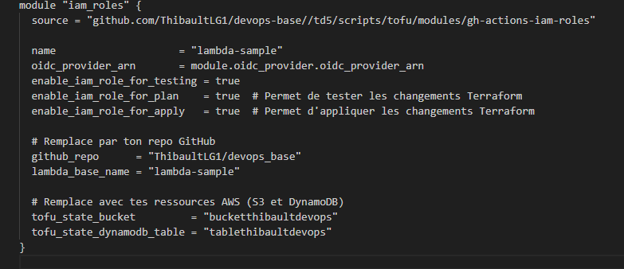

# README - Lab 5: CI/CD avec Kubernetes
### TD Réaliser par Thibault LE GUIDEVAIS et Thibault JABLONSKI

## 1. Intégration Continue (CI)

### Configuration du workflow GitHub Actions

1. Créer la structure de répertoire :

   ```sh
   cd ~/devops_base
   git checkout main
   git pull origin main
   mkdir -p td5/scripts/sample-app
   cp -r td4/scripts/sample-app td5/scripts/sample-app
   ```

2. Créer le fichier `.github/workflows/app-tests.yml` :

   ```yaml
   name: Sample App Tests
   on: push
   jobs:
     sample_app_tests:
       name: "Run Tests Using Jest"
       runs-on: ubuntu-latest
       steps:
         - uses: actions/checkout@v3
         - name: Install dependencies
           working-directory: td5/scripts/sample-app
           run: npm install
         - name: Run tests
           working-directory: td5/scripts/sample-app
           run: npm test
   ```

3. Tester le workflow :

   ```sh
   git add td5/scripts/sample-app .github/workflows/app-tests.yml
   git commit -m "Add sample-app and workflow"
   git push origin main
   ```

4. Créer une nouvelle branche pour tester un échec intentionnel :

   ```sh
   git checkout -b test-workflow
   ```

   Modifier `td5/scripts/sample-app/app.js` :

   ```js
   res.send('DevOps Labs!');
   ```


5. Corriger le test et vérifier que le workflow réussit :


## 2. Configuration de l'authentification OIDC avec AWS

1. Créer un fournisseur OIDC AWS avec OpenTofu :

   ```hcl
   provider "aws" {
     region = "eu-west-3"
   }

   module "oidc_provider" {
     source       = "github.com/ThibaultLG1/devops_base//td5/scripts/tofu/modules/github-aws-oidc"
     provider_url = "https://token.actions.githubusercontent.com"
   }
   ```

2. Créer les rôles IAM :

   ```hcl
   module "iam_roles" {
     source = "github.com/your_github_name/devops-base//td5/scripts/tofu/modules/gh-actions-iam-roles"
     name              = "lambda-sample"
     oidc_provider_arn = module.oidc_provider.oidc_provider_arn
     enable_iam_role_for_testing = true
     enable_iam_role_for_plan  = true
     enable_iam_role_for_apply = true
     github_repo      = "ThibaultLG1/devops_base"
     tofu_state_bucket = "bucketthibaultdevops"
     tofu_state_dynamodb_table = "tablethibaultdevops"
   }
   ```

3. Exécuter OpenTofu :

   ```sh
   cd td5/scripts/tofu/live/ci-cd-permissions
   tofu init
   tofu apply
   ```



## 3. Tests d'infrastructure avec OpenTofu

1. Créer le workflow `.github/workflows/infra-tests.yml` :
   ```yaml
   name: Infrastructure Tests
   on: push
   jobs:
     opentofu_test:
       name: "Run OpenTofu tests"
       runs-on: ubuntu-latest
       permissions:
         id-token: write
         contents: read
       steps:
         - uses: actions/checkout@v2
         - uses: aws-actions/configure-aws-credentials@v3
           with:
             role-to-assume: arn:aws:iam::463470972708:role/lambda-sample-tests
             aws-region: eu-west-3
         - uses: opentofu/setup-opentofu@v1
         - name: Tofu Test
           working-directory: td5/scripts/tofu/live/lambda-sample
           run: |
             tofu init -backend=false -input=false
             tofu test -verbose
   ```

## 4. Déploiement Continu (CD)


### 3.1 Configuration du Backend distant pour OpenTofu

1. Créer un backend S3 pour stocker l'état d'OpenTofu :
   ```hcl
   terraform {
     backend "s3" {
       bucket         = "bucketthibaultdevops"
       key            = "td5/scripts/tofu/live/tofu-state"
       region         = "us-east-2"
       encrypt        = true
       dynamodb_table = "tablethibaultdevops"
     }
   }
   ```




2. Appliquer la configuration du backend :
   ```sh
   cd td5/scripts/tofu/live/tofu-state
   tofu init
   tofu apply
   ```

### 3.2 Configuration des rôles IAM pour le déploiement

1. Modifier le module IAM pour activer les rôles pour le déploiement :
   ```hcl
   module "iam_roles" {
     source = "github.com/your_github_name/devops-base//td5/scripts/tofu/modules/gh-actions-iam-roles"
     name                     = "lambda-sample"
     oidc_provider_arn        = module.oidc_provider.oidc_provider_arn
     enable_iam_role_for_plan  = true
     enable_iam_role_for_apply = true
     github_repo               = "ThibaultLG1/devops_base"
     tofu_state_bucket         = "bucketthibaultdevops"
     tofu_state_dynamodb_table = "tablethibaultdevops"
   }
   ```



2. Appliquer les modifications :
   ```sh
   cd td5/scripts/tofu/live/ci-cd-permissions
   tofu init
   tofu apply
   ```

### 3.3 Configuration du pipeline de déploiement GitHub Actions


1. **Apply (tofu-apply.yml)** : Applique les changements après validation sur la branche `main`.
   ```yaml
   name: Tofu Apply
   on:
     push:
       branches: ["main"]
   jobs:
     apply:
       runs-on: ubuntu-latest
       permissions:
         id-token: write
         contents: read
       steps:
         - uses: actions/checkout@v3
         - uses: aws-actions/configure-aws-credentials@v3
           with:
             role-to-assume: ${{ secrets.APPLY_ROLE_ARN }}
             aws-region: us-east-2
         - uses: opentofu/setup-opentofu@v1
         - name: Terraform Apply
           run: |
             tofu init
             tofu apply -auto-approve
   ```

### 3.4 Test du pipeline de déploiement

1. Créer une nouvelle branche et y ajouter un changement :
   ```sh
   git checkout -b test-deployment
   echo "console.log('Test Deployment');" >> td5/scripts/sample-app/index.js
   git add td5/scripts/sample-app/index.js
   git commit -m "Test Deployment"
   git push origin test-deployment
   ```

Lors du test, on a rencontré un problème qu'on a pas su résoudre, notre github cherchait à télécharger depuis un dépo github qui n'est pas celui indiqué dans le main.tf de lambda_sample.


